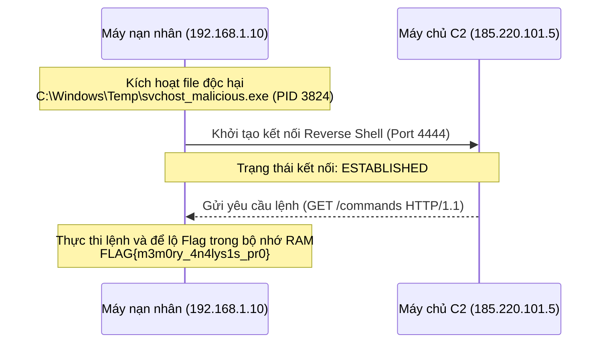

# Phân Tích Kịch Bản 3: Điều Tra Bộ Nhớ RAM (Memory Forensics)

Tài liệu này phân tích chi tiết **Kịch bản 3 (Scenario 3)** trong hệ thống **ForensicsLab**, bao gồm tổng quan kịch bản, các câu hỏi/flag tương ứng, cách thức tạo sinh chứng cứ số và hướng dẫn giải chi tiết (Walkthrough).

---

## 1. Tổng Quan Kịch Bản (Scenario Overview)

- **Tên Kịch Bản**: Memory Forensics (Phân tích RAM dump, phát hiện tiến trình ẩn)
- **Mô Tả**: Học viên phân tích tệp ảnh dump bộ nhớ RAM (`memory_dump.vmem`) để xác định các tiến trình độc hại chạy ẩn trong hệ thống và các kết nối mạng độc hại (C2) đang hoạt động.
- **Độ Khó**: Nâng cao (Advanced)
- **Thời Gian Ước Tính**: 120 phút
- **Điểm CTF Tối Đa**: 6.0 điểm (3 câu hỏi x 2.0 điểm/câu)
- **Công Cụ Khuyên Dùng**: Volatility 3 (`vol`), `strings`, `grep`.

---

## 2. Thông Tin Chứng Cứ Số (Evidence Files)

Thư mục chứng cứ số tương ứng nằm tại: [static/evidence/scenario_3/](file:///c:/ForensicsLab/static/evidence/scenario_3/)

### Danh sách tệp chứng cứ:
1. **`memory_dump.vmem`**:
   - **Mô tả**: Tệp RAM dump định dạng máy ảo VMware.
   - **Kích thước thực tế trên đĩa**: `2 MB` (Để tối ưu hiệu năng lưu trữ và tải trang).
   - **Kích thước mô phỏng hiển thị trên Terminal**: `1.0 GB` (Nhằm tăng tính thực tế cho bài thực hành).
   - **Mã băm SHA-256**: `ceefde32674ade8b6cae7990882cb939213dcb00dfe59939fc6c3e2961176d28`
2. **`memory_dump.vmem.sha256`**:
   - Tệp chứa mã băm SHA-256 của tệp `memory_dump.vmem` dùng để đối chiếu tính toàn vẹn.
3. **`readme.txt`**:
   - Hướng dẫn ban đầu cho học viên:
     ```text
     === MEMORY FORENSICS LAB ===
     Phân tích ảnh RAM memory_dump.vmem để tìm các tiến trình độc hại chạy ẩn và các kết nối mạng C2 hoạt động.
     Gợi ý sử dụng: volatility3 hoặc strings
     Acquired: 2026-05-22 10:05:00 UTC
     ```

---

## 3. Cơ Chế Tạo Sinh Chứng Cứ (Evidence Generation Mechanism)

Theo mã nguồn tại [generate_evidence.py](file:///c:/ForensicsLab/generate_evidence.py#L385-L432), tệp `memory_dump.vmem` được sinh ra tự động bằng cách nhúng trực tiếp các chuỗi nhị phân (binary strings) tương ứng vào các vùng offset cụ thể trong bộ nhớ đệm 2MB:

- **Danh sách tiến trình (Process list) tại offset `0x1000`**:
  ```python
  proc_strings = (
      b"System\x004\x00"
      b"services.exe\x001024\x00"
      b"svchost.exe\x003920\x00"
      b"svchost_malicious.exe\x003824\x00C:\\Windows\\Temp\\svchost_malicious.exe\x00"
      b"explorer.exe\x002180\x00"
  )
  ```
- **Danh sách kết nối mạng (Network connections) tại offset `0x5000`**:
  ```python
  net_strings = (
      b"ESTABLISHED\x00192.168.1.10:49210\x00185.220.101.5:4444\x003824\x00"
      b"LISTENING\x00192.168.1.10:135\x000.0.0.0:0\x00820\x00"
  )
  ```
- **Dữ liệu truyền thông C2 và Flag tại offset `0x8ff0`**:
  ```python
  c2_strings = (
      b'GET /commands HTTP/1.1\x00'
      b'Host: 185.220.101.5\x00'
      b'C2 Connection established. Shell spawned.\x00'
      b'FOUND FLAG IN RAM: FLAG{m3m0ry_4n4lys1s_pr0}\x00'
  )
  ```

---

## 4. Danh Sách Câu Hỏi & Đáp Án (Questions & Flags)

Dưới đây là các câu hỏi được cấu hình trong cơ sở dữ liệu cho Kịch bản 3:

| STT | Nội dung câu hỏi | Đáp án (Flag) | Điểm | Gợi ý cho học viên |
| :---: | :--- | :---: | :---: | :--- |
| **1** | Tìm PID của tiến trình svchost giả mạo đang chạy ẩn trong hệ thống. | **`3824`** | 2.0 | Dùng `vol -f memory_dump.vmem windows.pslist` hoặc `strings` để tìm tiến trình svchost đáng ngờ. |
| **2** | Địa chỉ IP và Port (dạng `IP:Port`) mà tiến trình độc hại kết nối tới để nhận lệnh? | **`185.220.101.5:4444`** | 2.0 | Dùng `vol -f memory_dump.vmem windows.netscan` hoặc `strings` để tìm kết nối `ESTABLISHED`. |
| **3** | Flag bí mật tìm thấy trong vùng nhớ strings của tiến trình độc hại là gì? | **`FLAG{m3m0ry_4n4lys1s_pr0}`** | 2.0 | Dùng `strings memory_dump.vmem` hoặc plugin strings tương ứng để tìm chuỗi `FLAG`. |

---

## 5. Quy Trình Điều Tra & Hướng Dẫn Giải (Investigation Walkthrough)

Học viên có thể giải quyết kịch bản này thông qua hai chế độ Terminal: **Simulated (Mô phỏng)** hoặc **Docker Live (Chạy thực tế)**. Dưới đây là các bước thực hiện trên Terminal:

### Bước 1: Kiểm tra tính toàn vẹn của file RAM Dump
Học viên chạy lệnh `sha256sum` để kiểm tra mã băm của tệp tin chứng cứ:
```bash
root@kali:~$ sha256sum memory_dump.vmem
ceefde32674ade8b6cae7990882cb939213dcb00dfe59939fc6c3e2961176d28  memory_dump.vmem
```
Kết quả khớp với mã băm lưu trong tệp `memory_dump.vmem.sha256` chứng tỏ tệp tin toàn vẹn, không bị lỗi hoặc bị thay đổi trong quá trình phân phối.

### Bước 2: Phát hiện tiến trình độc hại chạy ẩn (Câu hỏi 1)
Sử dụng plugin `windows.pslist` (hoặc `pslist`) của Volatility để hiển thị danh sách các tiến trình đang chạy tại thời điểm dump RAM:
```bash
root@kali:~$ vol -f memory_dump.vmem windows.pslist
```

**Kết quả mô phỏng trả về:**
```text
Offset(V)  Name                 PID   PPID   Thds   Hnds   Sess  Wow64  StartTime
---------- -------------------- ----- ------ ------ ------ ------ ------ -------------------------
0x823b8040 System                   4      0    112    2300   ----   No   2026-05-22 10:05:01
0x821f0020 services.exe          1024      4     16     320      0   No   2026-05-22 10:05:08
0x81da0040 svchost.exe           3920   1024     22     290      0   No   2026-05-22 10:05:10
0x81fa0030 svchost_malicious.exe 3824   1024      4     110      0   No   2026-05-22 10:06:14
0x81c85020 explorer.exe          2180   2040     35     920      1   No   2026-05-22 10:05:15
```

> [!IMPORTANT]
> **Phân tích**:
> - Tiến trình `svchost.exe` hợp lệ chạy dưới PID `3920`.
> - Xuất hiện tiến trình bất thường có tên `svchost_malicious.exe` chạy với PID **`3824`**.
> - Tiến trình này cố tình giả mạo tiến trình hệ thống `svchost.exe` nhưng đặt tên sai (`svchost_malicious.exe` hoặc chạy từ thư mục đáng ngờ như `C:\Windows\Temp\`).
> - **Đáp án Câu 1**: `3824`.

---

### Bước 3: Xác định kết nối mạng hướng ngoại (Câu hỏi 2)
Sử dụng plugin `windows.netscan` (hoặc `netscan`) của Volatility để liệt kê các kết nối mạng:
```bash
root@kali:~$ vol -f memory_dump.vmem windows.netscan
```

**Kết quả mô phỏng trả về:**
```text
Proto  Local Address          Foreign Address        State       PID      Owner
-----  ---------------------  ---------------------  ----------  -------  ------------------
TCP    192.168.1.10:135       0.0.0.0:0              LISTENING   820      svchost.exe
TCP    192.168.1.10:445       0.0.0.0:0              LISTENING   4        System
TCP    192.168.1.10:49210     185.220.101.5:4444     ESTABLISHED 3824     svchost_malicious.exe
TCP    192.168.1.10:53285     192.168.1.105:80       TIME_WAIT   0        -
```

> [!IMPORTANT]
> **Phân tích**:
> - Tiến trình độc hại `svchost_malicious.exe` (PID `3824`) đang có một kết nối mạng ở trạng thái `ESTABLISHED` từ IP cục bộ `192.168.1.10:49210` tới địa chỉ IP từ xa **`185.220.101.5:4444`**.
> - Đây là hành vi điển hình của Reverse Shell kết nối về máy chủ Command & Control (C2) của Hacker hoạt động trên cổng `4444`.
> - **Đáp án Câu 2**: `185.220.101.5:4444`.

---

### Bước 4: Trích xuất Flag bí mật từ bộ nhớ tiến trình (Câu hỏi 3)
Học viên có thể sử dụng plugin `strings` trên Volatility hoặc trực tiếp lệnh `strings` của Linux để tìm kiếm các chuỗi văn bản lưu trong bộ nhớ:
```bash
root@kali:~$ strings memory_dump.vmem | grep FLAG
```

**Kết quả trả về:**
```text
FOUND FLAG IN RAM: FLAG{m3m0ry_4n4lys1s_pr0}
```

> [!IMPORTANT]
> - Chuỗi flag được tìm thấy nguyên vẹn trong vùng nhớ RAM được cấp phát cho C2 communication strings.
> - **Đáp án Câu 3**: `FLAG{m3m0ry_4n4lys1s_pr0}`.

---

## 6. Sơ Đồ Luồng Tấn Công (Attack Flow Diagram)

Dưới đây là sơ đồ tóm tắt luồng tấn công được tái dựng từ việc phân tích RAM dump trong Kịch bản 3:


